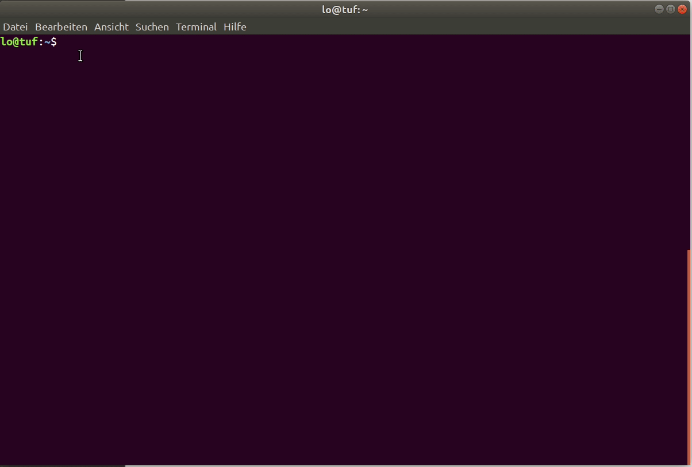

## 00 Installation

Conda is the package-manager which supports all the tools we currently use. Installing [miniconda](https://docs.conda.io/en/latest/miniconda.html) is the easiest way to make the conda-package-manager available on your system. Once conda is available you need to add the `conda-forge`-channel (conda-community packages) to the config: `conda config --add channels conda-forge` and create a new environment with openglider with `conda create -n openglider openglider freecad`. Once conda has found a compatible combination of packages, please review the shown list of packages and press `y` to create the environment. Once that process is done, you need to activate the environment with the conda-activation command: `conda activate openglider`. Now you are ready to use openglider, either via gui or directly with python. To start the freecad-gui simple start freecad by calling the executeable: `freecad`. Once freecad launched you will see a workbench switcher at the top (by default the start-workbench is loaded: Start). Click on the dropdown list and choose `glider`.  

  
  
  
[01 create glider](01_create-glider.md)