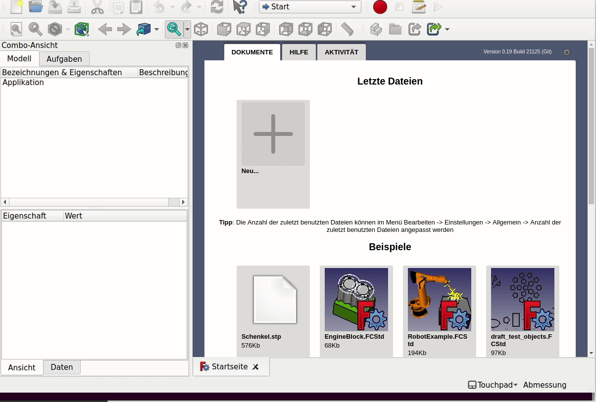

## 01 Create a glider

This command loads a predefined glider. The predefined glider is a speedflyer (small paraglider) which was never tested. You can use this base object to create a paraglider, a speedglider or a kite. The glider-workbench has all the tools available to modify the base object.  
  
  
  
[02 modify shape](02_modify-shape.md)