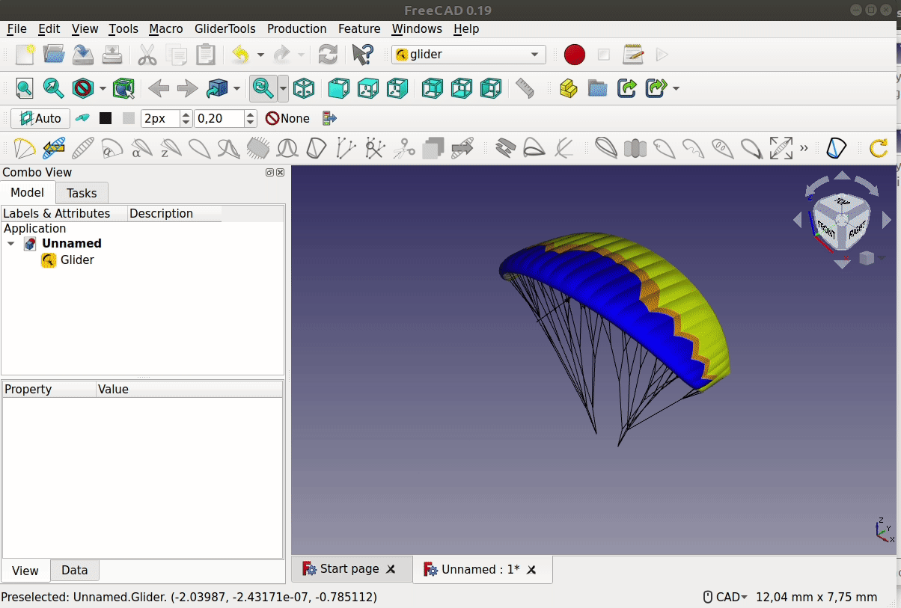

## 04 Modify angle of attack

The angle of attack (aoa) is defined as the angle of the airfoil to the freeflow stream (stream without influence of glider, relative to the glider). The rotation of the rib due to the arc is the basis for the rotation-axis of the aoa. The red curve is the relative angle (relative to the freestream-direction). The blue curve is the angle between a horizontal line and the airfoil. The difference between absolute and relative curve should be small at the wingtips. For a glider with vertical wingtips the absolute angel and the relative angles should be the same as the freestream is defined without a side-component.   
  
  
  
[05 modify airfoil](05_modify-airfoil.md)