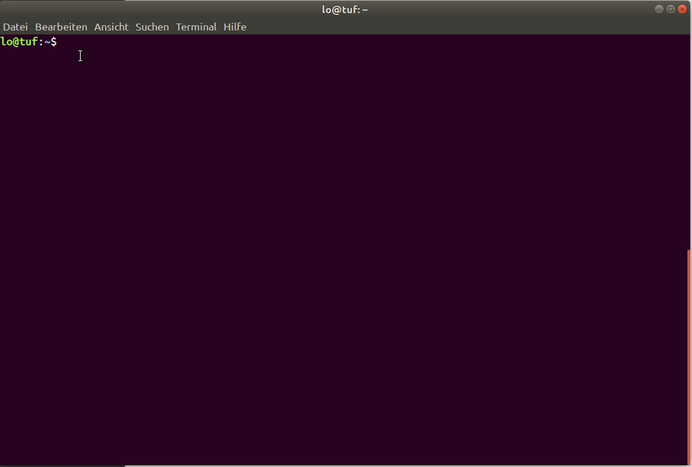
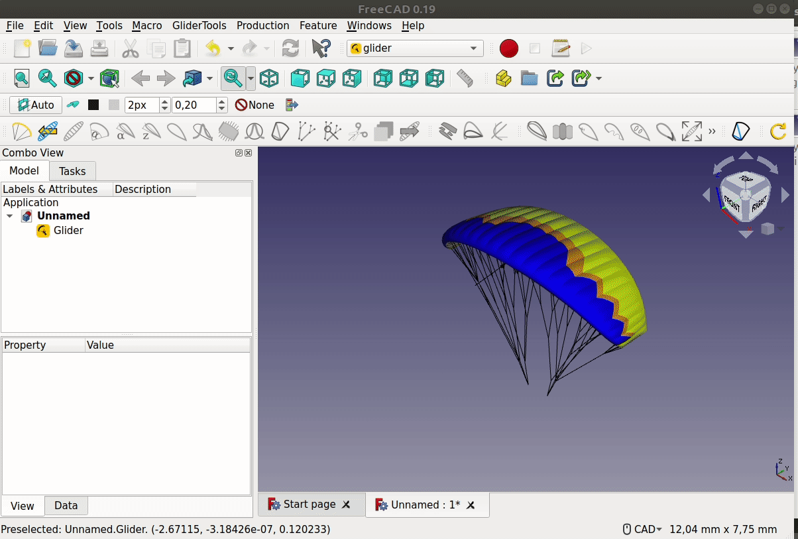
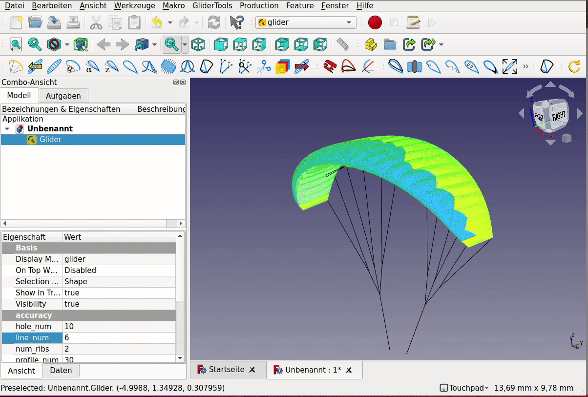
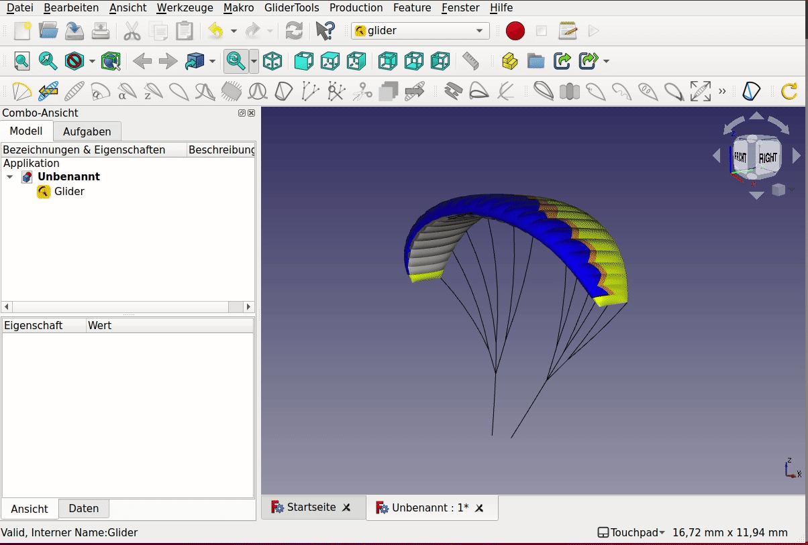

# glider tutorial with freecad

A simple tutorial on how to use openglider with freecad-gui.

## Openglider design-principles:

On the highest level openglider provides two classes which represent abstractions of a paraglider-model. The `ParametricGlider` is a parametric representation of a glider. Most propoerties of this object are defined by parametric geometries like nurbs and bezier-splines.
The `Glider` class itself is an direct representation of the paraglider. This object includes all the necessary subobject like ribs, cells, lines and all there properties. These properties are directly defined by numerical values.

The connection between a `ParametricGlider` and a `Glider` is given by the functions:
`glider = parametric_glider.get_glider_3d()`

The visual implementation of openglider in FreeCAD is done by using the mesh-functionalities available from openglider. The base-feature available in the glider-workbench is a `GliderFeature` which contains both a `ParametricGlider` and a `Glider`. There is a toolbox available to modify the parametric glider. These functions are all applied on the `GliderFeature` and therefore are not parametric (if you modify the glider it's not directly revertable -> still TODO).
On the other hand there is a toolbox available which adds functions to set parametric modifiers on top of the `GliderFeature`. These features allow to modify the `Glider`-object directly by copiing the `Glider` and modifiing some properties of the copy.

## Installation

Conda is the package-manager which supports all the tools we currently use. Installing [miniconda](https://docs.conda.io/en/latest/miniconda.html) is the easiest way to make the conda-package-manager available on your system. Once conda is available you need to add the `conda-forge`-channel (conda-community packages) to the config: `conda config --add channels conda-forge` and create a new environment with openglider with `conda create -n openglider openglider freecad`. Once conda has found a compatible combination of packages, please review the shown list of packages and press `y` to create the environment. Once that process is done, you need to activate the environment with the conda-activation command: `conda activate openglider`. Now you are ready to use openglider, either via gui or directly with python. To start the freecad-gui simple start freecad by calling the executeable: `freecad`. Once freecad launched you will see a workbench switcher at the top (by default the start-workbench is loaded: Start). Click on the dropdown list and choose `glider`.  

## Create a glider

This command loads a predefined glider. The glider-workbench has all the tools available to modify the glider.

## Modify the shape

This command adds the functionality to:
- modify the number of cells
- change the shape by bezier-splies
- set area, aspect-ratio, span
- distribute cells by distribution-tool
- auto distribute cells to equal cell aspect-ratio

## Modify the arc

## Modify angle of attack

## Modify airfoil

## Modify lines

## Inspect line forces and geometry

## Create cuts (design-tool)

## Modify colors

