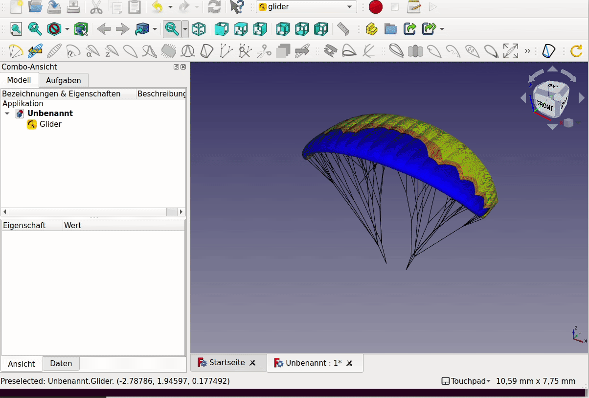

# glider tutorial with freecad

A simple tutorial on how to use openglider with freecad-gui.

## Openglider design-principles:

On the highest level openglider provides two classes which allows to create objects which represent models of paragliders. The `ParametricGlider` is a parametric representation of a glider. Most propoerties of this object are defined with parametric geometries like nurbs and bezier-splines.
The `Glider` class itself is an direct representation of the paraglider. This object includes all the necessary subobject like ribs, cells, lines and all there properties. These properties are directly defined by numerical values.

The connection between a ParametricGlider and a Glider is given by the functions:
`glider = parametric_glider.get_glider_3d()`

The visual implementation of openglider in freecad is done by using the mesh functionalities available from openglider. The base Feature is a `GliderFeature` which contains both a ParametricGlider and a GliderInstance. There is a toolbox available to modify the parametric glider. These functions are all applied on the `GliderFeature` and therefore are not parametric (if you modify the glider it's not directly revertable).
On the other hand there is a toolbox available which add functions to set parametric modifiers on top of the `GliderFeature`. These Features allow to modify the `Glider`-object directly by copieng the glider and modifieng some properties of the copy.

## Installation

Conda is the package-manager which support all the tools we currently use. Installing [miniconda](https://docs.conda.io/en/latest/miniconda.html) is the easiest way to make the conda-package-manager available on your system. Once conda is available you need to add the `conda-forge`-channel (conda-community packages) to the config: `conda config --add channels conda-forge` and create a new environment with openglider with `conda create -n openglider openglider freecad`. Once conda has found a compatible combination of packages, please review the shown list of packages and press `y` to create the environment. Once that process is done, you need to activate the environment with the conda-activation command: `conda activate openglider`. Now you are ready to use openglider, either via gui or directly with python. To start the freecad-gui simple start freecad by calling the executeable: `freecad`. Once freecad launched you will see a workbench switcher at the top (by default the start-workbench is loaded: Start). Click on the dropdown list and choose `glider`.  

## Create a glider

## Modify the shape

## Modify the arc

